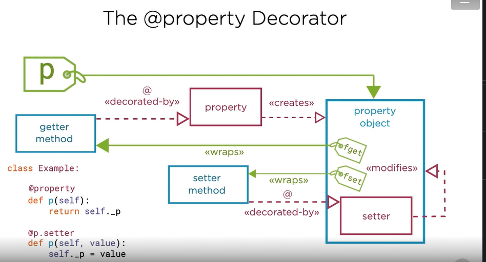

# Agenda 

1. Defining per-class
2. Using properties 
3. Represent your objects as strings 
4. Method resolution 
5. Transforming classes with class-decorators 
6. Creating simple data classes 

###  you'll know how to create idiomatic Python classes

# Prerequisites:

1. Essentials of python
2. Functions, classes and modules 
3. Core Python: Getting Started
4. Core Python: Functions and Functional Programming 

# Scopes in Python (LEGB)

1. local => inside the current function 
2. Enclosing => inside enclosing functions 
3. Global => At the top level of the module 
4. Built-in => In the special builtins module 

# The zen of python 
1. Explicit is better than implicit 
2. Readability counts 
3. There  is no class class scope in python